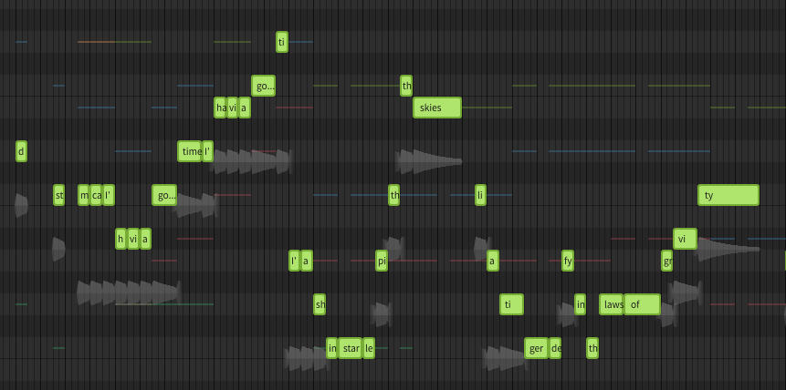
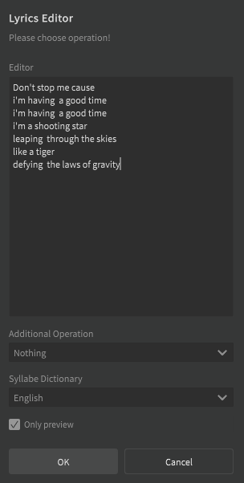
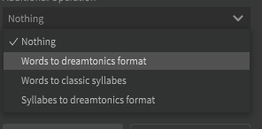
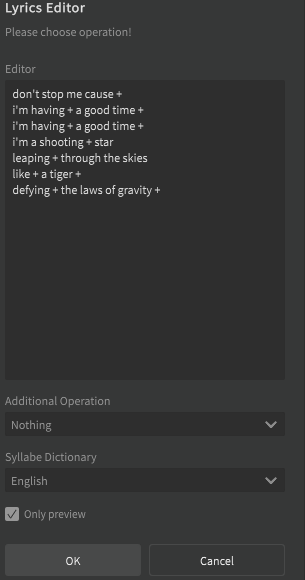
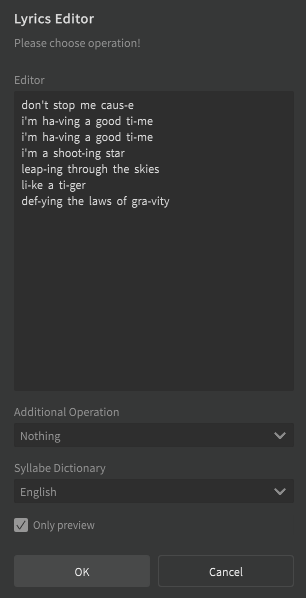
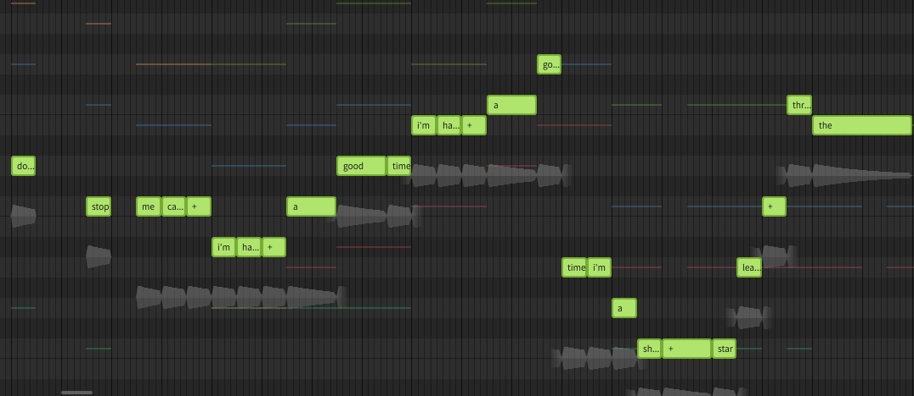

# SynthV-to-Language-Phoneme Plugin
**Synthesizer V Dreamtonics: Enhanced Lyrics Editor**

## INTRODUCTION

Hello everyone, I have developed this script to enhance current lyrics editor,
in particular
- you have a bigger textbox to handle the full lyrics of the song
- you can insert text with carriage returns without loosing the note synchronization
- you can transform the original text into classical syllabes (using a target source external dictionary) 

> e.g. children --> chil-dren
 
- you can transform the previous syllabes in "dreamtonics format"

> e.g. chil-dren --> children +

### Important Note: I have created files for the four "official" languages, but the syllabations rules for now are tested only on a subset of English words`

## INSTALLATION

Copy .lua script inside script folders.
Create a subdirectory "languages" and put inside it the .dic files.

NOTES: Check the script directory inside the script.
Current is set with "Documenti" name, if it's not working change it accordingly your path.

## HOW IT WORKS

### {language}-syl.DIC
This file contains the "syllabion rules" for extracting syllabes from words.
The structure is divided as follows:

> {RULE PLACEHOLDER},{REGEX SYLLABATION} {NUMBER OF SYLLABES}

Below is an example for the English "CVVC" rule (Consonant + Vocal + Vocal + Consonant)

> CVVC ^[bcdfghjklmnpqrstvwxyz][aeiouy][aeiouy][bcdfghjklmnpqrstvwxyz](.*) 4

## USAGE

The script could be used:
* Selecting a group of notes

* Opening GAF Utilities > Enhanced Lyrics Editor following interface appears

You can freely edit the text area as the official lyrics box, with the addition to use freely carriage returns

* You can on Operation block choose a specific work to do

Note: you can choose "Only Preview" checkbox to not close the lyrics editor (and not affect the real notes)

If you choose "Words to dreamtonics format", and click OK, the result will be this one:

If you choose "Words to classic syllabes", and click OK, the result will be this

When you're satisfied with your lyrics, you can remove the "Only preview" and click OK.

